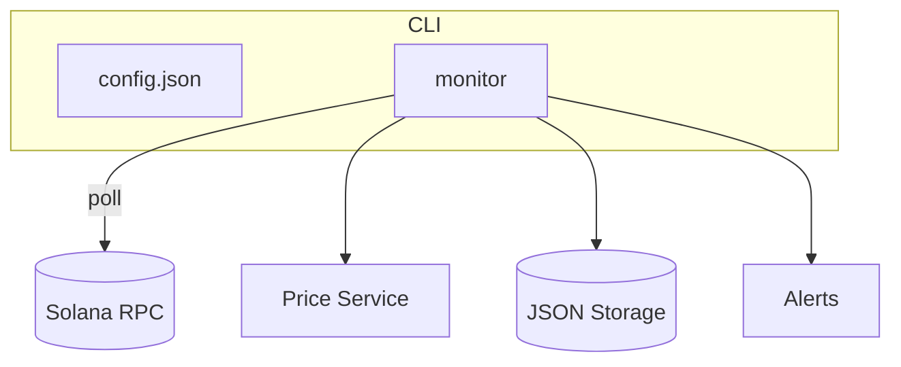

# Insider Monitor Improvement Report

## Executive Summary
The current monitor reliably polls Solana wallets and sends alerts, but it lacks
streaming ingestion, normalized storage, and insider‑oriented analytics. Moving
from a single-node poller to a resilient, queued pipeline with formalized data
models enables richer correlation, faster alerting, and historical backfills.
A structured scoring framework and algorithm suite will surface high‑risk
insider activity early, giving analysts a competitive edge. Investing now makes
future integrations (labels, MEV, compliance) simpler and positions the project
as the default open‑source Solana insider monitor.

## Current Architecture Map
- **cmd/monitor**: CLI entrypoint, loads config, orchestrates scan loop.
- **internal/monitor**: RPC client, token account scan, change detection.
- **internal/alerts**: Console or Discord alerter.
- **internal/price**: Jupiter price fetcher.
- **internal/storage**: JSON file persistence.
- **internal/utils**: structured logger.



## Developer Experience (DX) Audit
- Setup: needs dedicated RPC; no devcontainer or `.env.sample`.
- Makefile: build/run/test targets, but no lint/format shortcuts.
- Pre-commit: runs gofmt, go vet, golangci-lint, go mod tidy.
- Tests: minimal (`monitor_test.go`); no integration tests.
- Logging: custom logger with colorized levels; no structured fields.
- CI: GitHub workflow present but limited to lint/test on push.
- Typing: Go provides static types; no generics used for abstractions.

## Data/Infra
### Indexing & Ingestion
- **Current**: `GetTokenAccountsByOwner` polling with exponential backoff.
- **Improvement**: combine `logsSubscribe` and `blockSubscribe` for near
  real‑time updates plus a backfill worker using `getSignaturesForAddress`.
- **Ingestion Worker Retry Logic**:
```go
func runWorker(ctx context.Context, q Queue, h Handler) {
    for {
        task, ack := q.Pop(ctx)
        if err := h.Process(ctx, task); err != nil {
            q.Nack(task, backoff.For(task.Attempts))
        } else {
            ack()
        }
    }
}
```
- **Exactly-once**: store processed signature hashes and check before emit.

### Data Modeling
- **Schema**:
  - `wallets(id PK, address UNIQUE, labels JSONB)`
  - `programs(id PK, address UNIQUE, deployer FK wallets)`
  - `mints(id PK, address UNIQUE, authority FK wallets, decimals, token2022)`
  - `transfers(id PK, tx_sig UNIQUE, slot, source FK wallets, dest FK wallets,
    mint FK mints, amount, usd_value)`
  - `lp_events(id PK, program FK programs, pool, action, amount, slot)`
  - `labels(id PK, source, label, address FK wallets, ttl)`
- **Indexes**: `(slot DESC)` on transfers, `(address)` on wallets/mints,
  time‑partitioned tables per day for transfers and lp_events.

## Reliability/Sec/Compliance
- Secrets stored in `config.json`; no env vars or vault support.
- No handling for chain reorgs or duplicate transactions.
- A single malformed record could halt scanning (no poison-pill isolation).
- Retention policy undefined; GDPR/PII considerations absent.
- No explicit audit logging or tamper‑proof storage.

## New Features (non-UI)
### 1. WebSocket Streaming Ingestion
- **Why**: Reduce latency and load by subscribing to token account changes.
- **Data Needed**: `accountSubscribe` & `logsSubscribe` feeds.
- **How**: Maintain durable WebSocket connections with resume logic; push
  events into a queue.
- **Complexity**: Medium.
- **Risk**: Connection churn; out-of-order events.
- **Success Metric**: <5s end-to-end alert latency.

### 2. Historical Backfill Service
- **Why**: Recover missed events and compute historical scores.
- **Data Needed**: `getSignaturesForAddress` and `getTransaction` RPC calls.
- **How**: Paginated worker pulling signatures until known checkpoint,
  storing idempotent tasks.
- **Complexity**: Medium.
- **Risk**: RPC rate limits; large history volume.
- **Success Metric**: 99% completion of 30‑day backfills without duplication.

### 3. Queue-based Processing Pipeline
- **Why**: Decouple ingestion from analysis; enable retries.
- **Data Needed**: Redis Streams/Kafka/NATS.
- **How**: Producers push event envelopes; workers acknowledge once committed.
- **Complexity**: Medium.
- **Risk**: Operational overhead.
- **Success Metric**: Zero message loss in chaos tests.

### 4. Normalized Postgres Storage
- **Why**: Queryable history and joins across wallets/programs.
- **Data Needed**: Schema for wallets, tokens, transfers, authorities.
- **How**: Use `pgx` with migration tool; partition tables by day.
- **Complexity**: High.
- **Risk**: Migration errors; storage cost.
- **Success Metric**: <100ms query latency for recent wallet history.

### 5. RPC Provider Abstraction with Failover
- **Why**: Avoid downtime and distribute load across providers.
- **Data Needed**: List of endpoints, health metrics.
- **How**: Weighted round‑robin client with per‑provider rate tracking.
- **Complexity**: Medium.
- **Risk**: Endpoint inconsistency.
- **Success Metric**: 99.9% scan uptime across outages.

### 6. Reorg and Finality Handling
- **Why**: Prevent false alerts on forked blocks.
- **Data Needed**: Slot confirmations, `getBlock` with commitment levels.
- **How**: Delay processing until `finalized` commitment; rollback on
  detected reorgs.
- **Complexity**: Medium.
- **Risk**: Longer latency.
- **Success Metric**: Zero false alerts in simulated reorgs.

### 7. Secret & Config Management
- **Why**: Protect webhook keys and RPC URLs.
- **Data Needed**: Environment variable support or Hashicorp Vault.
- **How**: Replace file‑based secrets; load via `viper` or custom loader.
- **Complexity**: Low.
- **Risk**: Misconfiguration.
- **Success Metric**: No secrets committed; CI lint passes.

### 8. Price & Metadata Caching Layer
- **Why**: Minimize repeated RPC/HTTP calls.
- **Data Needed**: LRU cache for token metadata & prices.
- **How**: Cache with TTL; warm on startup.
- **Complexity**: Low.
- **Risk**: Stale data.
- **Success Metric**: <10% of scans require external price calls.

## Insider Analysis Algorithms
### 1. Deploy/Upgrade Correlation
- **Intuition**: Wallets deploying or upgrading programs often retain tokens.
- **Signals**: `BPFLoader` deploy/upgrade instructions, subsequent token
  transfers.
- **Score**:
```pseudo
score = 40*deploy_link + 60*post_deploy_accum
```
- **Threshold**: flag if score ≥70.
- **False Positives**: Dev tooling accounts.
- **Validation**: Cross‑check with known legitimate deployers.

### 2. Authority Hygiene
- **Intuition**: Non‑renounced mint/freeze authorities indicate control.
- **Signals**: `setAuthority` instructions; token age.
- **Score**:
```pseudo
score = 50*(has_freeze) + 30*(recent_change<7d) + 20*(unknown_authority)
```
- **Threshold**: ≥60.
- **False Positives**: Legit DAOs retaining freeze for security.
- **Validation**: Sample of top tokens.

### 3. Early Accumulator Detector
- **Intuition**: Insiders accumulate before TGE or liquidity.
- **Signals**: time‑weighted incoming transfers vs TGE slot.
- **Score**:
```pseudo
score = Σ((TGE_slot - tx_slot)/TGE_slot * amount)
```
- **Threshold**: top 1% of accumulation score.
- **False Positives**: Seed investors.
- **Validation**: Compare against public vesting lists.

### 4. LP Birth & Control
- **Intuition**: First LP providers often insiders.
- **Signals**: Raydium/Orca `AddLiquidity`, `RemoveLiquidity` events.
- **Score**:
```pseudo
score = 70*is_first_adder + 30*removal_within_24h
```
- **Threshold**: ≥70.
- **False Positives**: Market makers.
- **Validation**: Tag known MM addresses.

### 5. Serial Deployer Risk
- **Intuition**: Many unrelated token launches by same wallet are suspect.
- **Signals**: Count of unique mint authorities & program deploys.
- **Score**:
```pseudo
score = min(100, 10 * num_tokens_launched)
```
- **Threshold**: ≥60.
- **False Positives**: Launchpad services.
- **Validation**: Manual review of high scorers.

### 6. Community/Graph Signals
- **Intuition**: Shared funders or multisigs cluster insiders.
- **Signals**: Transaction graph, common signers, community detection.
- **Score**:
```pseudo
score = 100 * pagerank(v)
```
- **Threshold**: top percentile per cluster.
- **False Positives**: Airdrop farmers.
- **Validation**: Compare clusters to known teams.

### 7. CEX Proximity
- **Intuition**: Rapid transfers to known CEX wallets indicate exit intent.
- **Signals**: Transfers to/from exchange clusters within short window.
- **Score**:
```pseudo
score = 60*deposit_within_24h + 40*withdraw_to_same_wallet
```
- **Threshold**: ≥60.
- **False Positives**: Legit trading activity.
- **Validation**: Exclude market makers.

### 8. Airdrop/Farming Footprint
- **Intuition**: Multi-mint farming patterns link insiders to teams.
- **Signals**: Repeated participation in airdrop claim programs.
- **Score**:
```pseudo
score = 5 * num_airdrop_claims * uniqueness_factor
```
- **Threshold**: ≥50.
- **False Positives**: Power users.
- **Validation**: Correlate with known farmer lists.

### 9. Jito/MEV Adjacency
- **Intuition**: Privileged access to bundles indicates insider flow.
- **Signals**: High priority fees, bundle slots around launches.
- **Score**:
```pseudo
score = 40*(priority_fee>threshold) + 60*(bundle_near_event)
```
- **Threshold**: ≥70.
- **False Positives**: Arbitrage bots.
- **Validation**: Compare with public MEV bundle datasets.

### 10. Anomaly Windows
- **Intuition**: Sudden change in transfer volume hints at insider action.
- **Signals**: Change‑point detection on moving averages.
- **Score**:
```pseudo
score = 100 * (abs(z_score) > 3)
```
- **Threshold**: z-score >3.
- **False Positives**: Legit marketing events.
- **Validation**: Align with official announcements.

### Scoring & Validation
- **Unified Score**:
```go
type Features struct {
    DeployLink, Authority, EarlyAccum, LPControl, Serial, Graph,
    CEX, Farming, MEV, Anomaly float64
}

func InsiderScore(f Features) float64 {
    weights := map[string]float64{
        "DeployLink":0.1, "Authority":0.1, "EarlyAccum":0.15,
        "LPControl":0.1, "Serial":0.1, "Graph":0.1,
        "CEX":0.1, "Farming":0.1, "MEV":0.05, "Anomaly":0.1,
    }
    score := f.DeployLink*weights["DeployLink"] + ... // sum all
    return math.Max(0, math.Min(score*100, 100))
}
```
- **Calibration**: backtest on 6‑month history; manual review of top 1%.
- **Metrics**: target precision ≥0.8, recall ≥0.6 on labeled dataset.

### Performance & Cost
- Batch RPC calls, reuse cursors, and cache `getRecentPrioritizationFees`.
- Benchmark CPU/mem for workers; set SLO: 200 QPS, <100ms per event.
- Profile with `pprof`; monitor RPC credit usage per provider.

### Testing & Tooling
- `solana-test-validator` scenarios: new mint, authority change, LP add/remove,
  program upgrade, large transfer.
- Property tests for parsers; golden files for edge transactions.
- Chaos tests simulating disconnects/duplicates.
- CI matrix: lint, unit tests, race detector, fuzzy parsing target.

### Integrations & Labels
- Define `LabelProvider` interface:
```go
type LabelProvider interface {
    Fetch(ctx context.Context, addr solana.PublicKey) (Label, error)
    Source() string
    TTL() time.Duration
}
```
- Provenance field per label; caching with TTL; resolve conflicts by
  precedence of provider trust score.

## Prioritized Roadmap
**Impact × Effort Matrix**
| Item | Impact | Effort | Quadrant |
|------|--------|--------|----------|
| Streaming Ingestion | High | Medium | Quick Win |
| Normalized Storage | High | High | Deep Work |
| Scoring Framework | High | Medium | Quick Win |
| RPC Failover | Medium | Medium | Quick Win |
| Reorg Handling | Medium | Medium | Quick Win |
| Queue Pipeline | High | Medium | Deep Work |
| Backfill Service | Medium | Medium | Quick Win |
| Secret Management | Medium | Low | Quick Win |

**30‑Day**: implement streaming ingestion prototype, secret management, basic
score module, and CI improvements.

**60‑Day**: add queue pipeline, RPC failover, historical backfill, and
normalized Postgres schema.

**90‑Day**: deploy full insider scoring suite, reorg handling, MEV adjacency
signals, and performance benchmarking.

Critical path: streaming ingestion → queue pipeline → normalized storage →
scoring/algorithms.

## Minimal PR Plan
1. **`internal/ingest/stream.go`**
```go
type StreamSource interface {
    Start(ctx context.Context, out chan<- Event) error
}
```
   - Test with `solana-test-validator` emitting a token transfer.
2. **`internal/score/score.go`**
```go
type FeatureExtractor interface {
    Extract(tx Event) Features
}
func InsiderScore(f Features) float64 { /* weighted sum */ }
```
   - Unit test with mocked features.

## References
- Solana JSON-RPC API: https://docs.solana.com/developing/clients/jsonrpc-api
- Raydium program ID: `4RV6GLc7D4s99y1yvE4s46HoPazTA7kG6LJJLLq5yRvV`
- Orca Whirlpool ID: `whirLbMpr5Pbnyp3RMd2ix4mvkAG2wE8xmPKD4D78YL`
- Token-2022 program: `TokenzQdBNbLqP4jKUzRcBT8QAjmZdz27oXUk5qsC3i`
