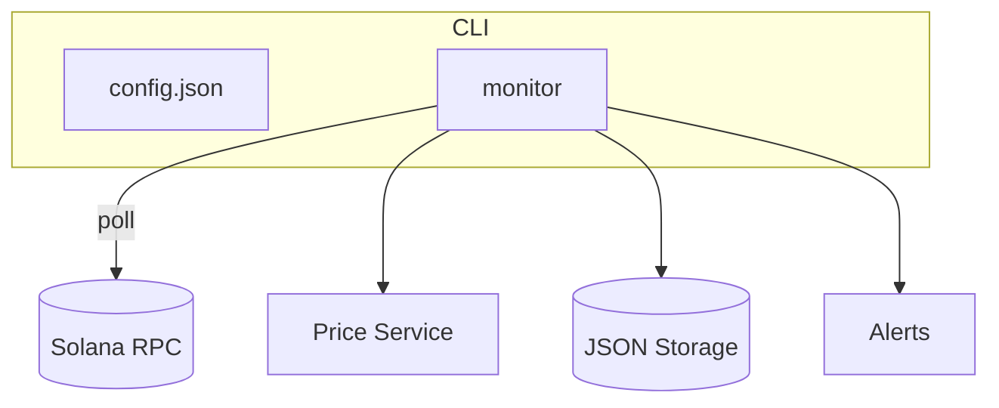

# Insider Monitor 改进报告

## 执行摘要
当前的监控器可以可靠地轮询 Solana 钱包并发送警报，但缺乏流式摄取、规范化存储和面向内部人的分析。从单节点轮询器迁移到具有队列的弹性管道，并定义结构化的数据模型，可实现更丰富的关联、更快的警报以及历史回填。构建评分框架和算法套件能够及早发现高风险的内部人行为，为分析人员提供竞争优势。

## 当前架构概览
- **cmd/monitor**：命令行入口，加载配置并控制扫描循环
- **internal/monitor**：RPC 客户端、代币账户扫描、变化检测
- **internal/alerts**：控制台或 Discord 警报
- **internal/price**：Jupiter 价格获取器
- **internal/storage**：JSON 文件持久化
- **internal/utils**：结构化日志

## 开发者体验审计
- 需要专用 RPC；没有 devcontainer 或 `.env.sample`
- Makefile 仅包含构建/运行/测试目标，缺少 lint/format 快捷方式
- pre-commit 运行 gofmt、go vet、golangci-lint、go mod tidy
- 测试较少；缺乏集成测试
- 日志使用自定义颜色，无结构化字段
- CI 仅在 push 时运行 lint/test

## 数据与基础设施改进建议
- 结合 `logsSubscribe` 和 `blockSubscribe` 实现近实时更新，并通过 `getSignaturesForAddress` 回填
- 使用队列抽象处理任务，支持重试和死信
- 采用规范化的 Postgres 存储模式，以便查询和历史分析
- 引入 RPC 端点故障切换和速率追踪
- 引入 Secret 管理和安全扫描，避免将密钥写入配置文件

## 新特性构想
1. **WebSocket 流式摄取**：降低延迟，维持持久连接并将事件推入队列
2. **历史回填服务**：使用 `getSignaturesForAddress` 和 `getTransaction` 拉取遗漏事件
3. **基于队列的处理管道**：生产者写入事件，工作者消费并确认
4. **规范化的 Postgres 存储**：按日分区，支持快速查询
5. **RPC 提供商抽象与故障转移**：加权轮询，跟踪每个提供商的健康状况
6. **链重组处理与重复检测**：保持回滚日志，确保精确一次语义
7. **内部人评分框架**：提炼特征，计算风险分数，并设定阈值

## 优先级路线图
- **30 天**：原型化流式摄取、引入密钥管理、基础评分模块、改进 CI
- **60 天**：加入队列管道、RPC 故障切换、历史回填、Postgres 结构
- **90 天**：部署完整评分套件、处理重组、MEV 相关信号、性能基准

